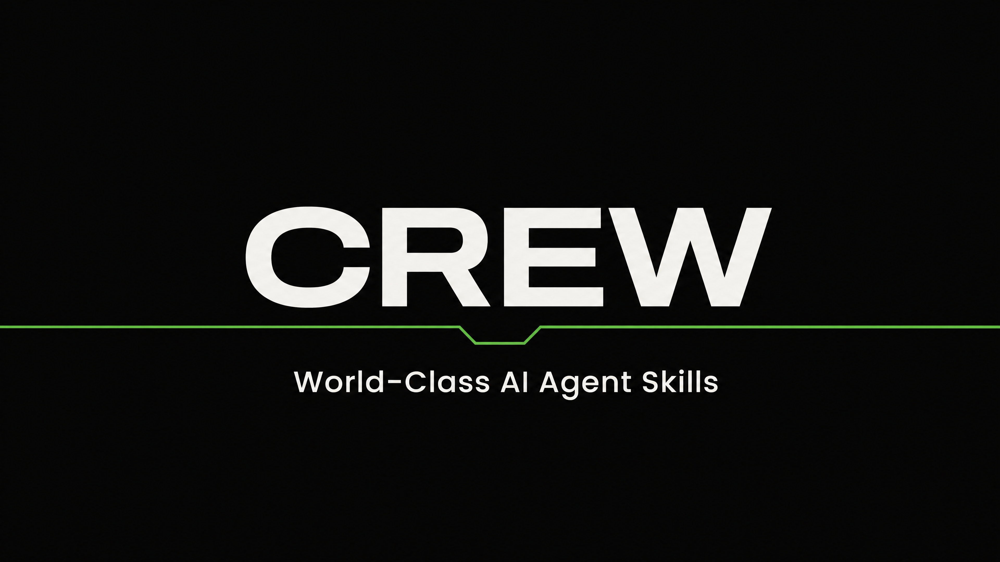

<p align="center">
  
</p>


<p align="center">
  
  
  
  
  
</p>

<p align="center">
  <strong>Claude Code · Hermes Agent · OpenClaw</strong>
</p>

---

# CREW: World-Class AI Agent Skills

> **The only agent skill pack with a built-in brand context system.** 98 gold-standard skills. 14 packs. Every business function covered. Onboard your business once, and every skill knows your brand, your voice, and your audience.

---

## What CREW is

CREW gives your AI agents the skills to operate as a full business team. Not one agent with surface-level knowledge: 98 specialised skills that know their domain, reference each other, and produce premium output with built-in quality gates.

**What makes CREW different:**

| CREW | Standard AI Skills |
|------|-------------------|
| 11-question business onboarding, every skill knows your brand | Generic prompts, no business context |
| Design review gates cross-reference 3 packs before output ships | No quality gates, output is whatever the model produces |
| 3-lens adversarial review on every skill | No adversarial review, bugs ship to production |
| Brand context persists across all 98 skills | Each skill is an island, no shared knowledge |
| Evidence/Inference discipline, nothing fabricated | No fabrication guardrails |

---

## Quick Start

```bash
# Clone
git clone https://github.com/jaredcroxton/crew-skill-packs.git
cd crew-skill-packs

# Route A (recommended): direct install into ~/.claude/skills
bash install.sh --all --global

# Route B: Claude Code plugins (generate the plugin tree + manifest first)
bash build-plugins.sh
# then inside Claude Code:  /plugin marketplace add ./crew-skill-packs
#                           /plugin install crew-full@crew-packs

# Other platforms
cp -r packs/* ~/.hermes/skills/crew/      # Hermes Agent
claw skills import ./packs/               # OpenClaw
```

**Then restart your Claude session.** Skills load at session start; after any install or update, a fresh session is what makes them visible.

**First run:** Run any skill. It asks 11 questions about your business (or run `crew-core-brand-context` directly). After that, every skill knows who you are. Worked example brand files live under `examples/brand-context/`.

**Runs best on:** a Sonnet-class model or better. Smaller models hold the skill discipline less reliably; the status vocabulary, the run receipt, and the onboarding gate degrade first.

**Updating:** `git pull && bash install.sh --all --global --force --prune` (prune removes renamed or retired Crew skills, never anything else). Zip buyers: see `shared/INSTALL.md`. After any install or update, `bash install.sh --doctor --global` checks the install is healthy.

**QA smoke suite:** `bash shared/qa-check.sh --smoke` invokes the Claude CLI roughly once per skill (about 98 metered calls on the full catalogue). Use `--pack <id>` to narrow it. The structural pass (`bash shared/qa-check.sh`) is free.

---

## Architecture

### The skill flow

Every skill follows the same disciplined path:

```
                    ┌──────────────────────────┐
                    │   BUSINESS ONBOARDING     │
                    │   11 questions, one file  │
                    │   brand-context.md        │
                    └──────────┬───────────────┘
                               │
                               ▼
                    ┌──────────────────────────┐
                    │   SKILL INVOKED           │
                    │   98 skills, 14 packs     │
                    └──────────┬───────────────┘
                               │
                               ▼
                    ┌──────────────────────────┐
                    │   BRAND CONTEXT LOADED    │
                    │   Every skill reads it    │
                    └──────────┬───────────────┘
                               │
                               ▼
                    ┌──────────────────────────┐
                    │   DISCOVERY               │
                    │   fresh / continuing /    │
                    │   existing brand          │
                    └──────────┬───────────────┘
                               │
                               ▼
                    ┌──────────────────────────┐
                    │   BUILD → GATE → OUTPUT   │
                    │   Design review cross-    │
                    │   references packs 12-14  │
                    └──────────────────────────┘
```

### The 8 Crew Standards

Every skill upholds these. They are the bedrock under every pack:

1. **Brainstorm before building.** Clarify what the business actually needs. Surface assumptions. Do not solve the wrong problem well.
2. **Plan in bite-sized tasks.** Break work into small, testable steps. Each step has a checkable result.
3. **Build with testing built in.** Verify each step works before moving to the next. Evidence over assumption.
4. **Debug from root cause.** Find why something broke before fixing it. No surface patches.
5. **Verify before claiming done.** Check the output against the original request. Claiming done without checking is dishonesty, not speed.
6. **Review before shipping.** A second set of eyes on important work, always. The mind that made the work is the worst judge of it.
7. **Finish cleanly.** Tidy up, document decisions, hand over properly. No loose ends.
8. **Save and restore context.** Capture where work left off so the next session starts with full understanding.

### The 5 Core Loops

A standard is what good looks like. A loop is what the skill does when reality is messy. Every skill carries all five:

| Loop | Trigger | Action |
|------|---------|--------|
| **Missing Input** | A required input is absent or contradictory | Name what is missing. Ask once. If unavailable, proceed and mark every affected field. Never fabricate. |
| **Quality Failure** | Verification finds output does not meet the brief | Stop. Name the specific gap. Fix or route. Re-verify. Record what failed. |
| **Escalation** | Work needs a decision this skill cannot make | Stop at the boundary. Produce everything up to it. Name who must decide. Never guess. |
| **Context Change** | Start and end of every run | Step 0: read the handoff. Final Step: write what was done, what was decided, what remains. |
| **Learning Capture** | A correction, preference, or fact surfaces | Record it in the handoff. An unrecorded lesson is a repeated mistake. |

### Design system: Bedrock / Fuel / Engine

The design packs use a three-layer architecture. Only the Engine is customer-facing:

```
BEDROCK (Pack 12 : Design Standards, 8 skills)
The eye. Quality, composition, patterns, language, reference.
Embedded into every build skill's gate. Never invoked directly.

        ↓

FUEL (Packs 13-14 : Design Styles + Animation, 17 skills)
The look and the motion. Visual languages + animation engines.
Embedded into build skills. Never invoked directly.

        ↓

ENGINE (Pack 10 : Web Design, 13 skills)
The output. Slide decks, cinematic sites, dashboards, scroll journeys.
The only skills a business invokes. One call, one output.
```

### Three words that define the Crew

- **Skill:** one disciplined job, done the same reliable way every time.
- **Agent:** a skill wearing an expert role, making judgement calls within its guardrails.
- **Context:** the memory that carries between runs, so the Crew gets smarter, not just busier.

---

## Packs

| # | Pack | Skills | What it does |
|---|------|--------|-------------|
| 01 | Core | 8 | Brand onboarding, context, quality, planning |
| 02 | Sales | 7 | Lead research, outreach, proposals, pipeline |
| 03 | Marketing | 7 | Campaigns, brand voice, content, SEO, social |
| 04 | Ops | 5 | Process mapping, automation, dashboards |
| 05 | HR | 5 | Interviews, role profiles, performance, policy |
| 06 | Finance | 6 | Invoicing, expenses, cashflow, dashboards |
| 07 | Support | 6 | Ticket triage, replies, FAQ, escalation |
| 08 | Docs | 7 | SOPs, policies, training guides, handovers |
| 09 | Training | 8 | Needs analysis, modules, facilitation, onboarding |
| 10 | Web Design | 13 | Slide decks, cinematic sites, scroll journeys |
| 11 | Infrastructure | 1 | Project scaffolding |
| 12 | Design Standards | 8 | Quality, composition, patterns, language |
| 13 | Design Styles | 5 | Brutalist, minimalist, soft, redesign |
| 14 | Animation | 12 | GSAP, Motion, Lottie, Rive, Spring, CSS |

---

## Skill Quality

Every skill is gold-standard. Here is what that means:

| Standard | What it does |
|----------|-------------|
| **15+ sections** | Every skill has Discovery, Modes, domain reference sections, Decision briefs, Verification, Completion |
| **3-lens adversarial review** | Harness check + white-label scan + senior domain expert before QA |
| **Design review gates** | Build skills cross-reference packs 12-14, block output on failure |
| **Fixtures** | Cases A, B, C per skill: clean, messy, and missing-input scenarios |
| **0 em dashes** | Strict white-label discipline across all 98 skills |
| **0 banned terms** | No leaked internal names, no placeholder names |
| **Evidence/Inference discipline** | Every claim labelled. Nothing fabricated. |
| **AU-law jurisdiction-neutral** | Business sets jurisdiction once. Skills adapt. |

---

## Compatibility

| Platform | Support |
|----------|---------|
| Claude Code | Native, install via plugins or source |
| Hermes Agent (Nous Research) | Compatible, copy packs to `~/.hermes/skills/` |
| OpenClaw | Compatible, `claw skills import` |
| Any agentskills.io platform | Standard SKILL.md format |

---

## FAQ

**Do I need all 14 packs?** No. Install what you need. A sales team might only want packs 02 (Sales) and 07 (Support). A design agency might only want 10 (Web Design), 12 (Standards), 13 (Styles), and 14 (Animation).

**Can I use this with my existing Claude Code setup?** Yes. CREW skills are standard SKILL.md files. They sit alongside your existing skills.

**What happens if a skill produces bad output?** All build skills have design review gates that cross-reference packs 12-14. Output that fails the gate is blocked. Non-build skills have Verification sections with checklists. Nothing ships unverified.

**How do I contribute a skill?** Open an issue with your skill idea. We review against the gold standard (15+ sections, 3-lens review, fixtures, white-label). Accepted skills are added to the appropriate pack.

---

## License

MIT. Use freely, modify freely, credit appreciated.
